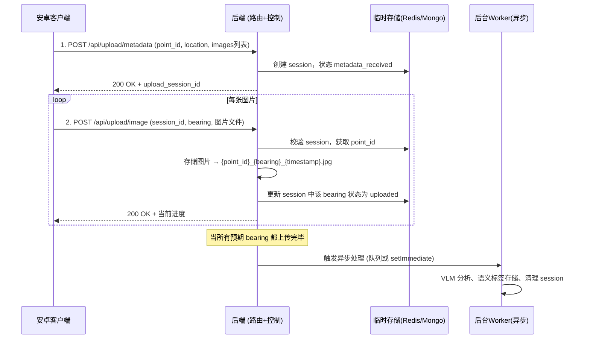

# 方案二完整形态：两步上传 + 异步处理

> 本方案适用于网络不稳定、图片数量不固定且需要重传的场景。  
> 核心：元数据与图片分离上传，每张图片携带方位角（bearing），后端异步完成 VLM 分析与语义标签存储。

---

## 一、总体流程



---

## 二、数据格式定义

### 2.1 元数据上传 `POST /api/upload/metadata`

**请求体** (JSON)

```json
{
  "point_id": "P_1744567890123_a3f5",        // 安卓生成，全局唯一
  "location": {
    "lat": 23.1291,
    "lng": 113.2644
  },
  "scene_description": "天桥入口附近有盲道",   // 可选
  "images": [
    { "bearing": 45, "description": "前方天桥" },
    { "bearing": 90, "description": "右侧商铺" },
    { "bearing": 135, "description": "盲道" }
  ]
}
```

**响应体** (成功，HTTP 201)

```json
{
  "success": true,
  "upload_session_id": "S_1744567891234_xyz",
  "message": "元数据已接收，请使用 session_id 上传图片"
}
```

**错误示例** (point_id 已存在)

```json
{
  "success": false,
  "error": "point_id already exists",
  "message": "该点已完成上传，不可重复"
}
```

### 2.2 单张图片上传 `POST /api/upload/image`

**请求体** `multipart/form-data`

| 字段 | 类型 | 必填 | 说明 |
|------|------|------|------|
| `upload_session_id` | string | 是 | 元数据返回的 session_id |
| `bearing` | integer | 是 | 0~360，必须与元数据中声明的某个 bearing 匹配 |
| `description` | string | 否 | 覆盖元数据中的 description |
| `image` | file | 是 | 图片文件 (JPEG/PNG) |

**响应体** (成功，HTTP 200)

```json
{
  "success": true,
  "bearing": 45,
  "uploaded_count": 3,
  "total_count": 8,
  "message": "图片上传成功，当前已上传 3/8 张"
}
```

**错误示例** (session 不存在或已完成)

```json
{
  "success": false,
  "error": "invalid_session",
  "message": "session 不存在或已过期"
}
```

### 2.3 查询上传进度 (可选) `GET /api/upload/session/{session_id}`

**响应体**

```json
{
  "success": true,
  "session_id": "S_xxx",
  "status": "partial_upload",   // metadata_received, partial_upload, complete, processing, done, failed
  "point_id": "P_...",
  "total_images": 8,
  "uploaded_bearings": [45, 90, 135],
  "pending_bearings": [180, 225, 270, 315, 360],
  "created_at": "2025-...",
  "updated_at": "2025-..."
}
```

---

## 三、后端各层职责

### 3.1 路由层 (routes/upload.js)

- `router.post('/metadata', metadataController.create);`
- `router.post('/image', imageUploadController.upload);`
- `router.get('/session/:sessionId', sessionController.getStatus);`

### 3.2 控制层

#### `metadataController.js`

- 校验 `point_id` 是否已存在于正式库（`sampling_points` 或 `semantic_tags`），以及临时存储中是否有未过期的 session。
- 生成 `upload_session_id`（格式 `S_{timestamp}_{random}`）。
- 调用 `pendingUploadService.createSession(sessionId, data)` 存储到临时存储（Redis 或 MongoDB），初始状态 `metadata_received`，所有 bearing 标记为 `pending`。
- 返回 `session_id`。

#### `imageUploadController.js`

- 从 `req.body` 获取 `upload_session_id` 和 `bearing`。
- 调用 `pendingUploadService.getSession(sessionId)`，如果 session 不存在、已过期或状态为 `done`/`failed`，返回 404。
- 从 session 中获取 `point_id`。
- 调用 `imageStorageService.saveImage(point_id, bearing, req.file)`，保存图片并返回最终路径。
- 调用 `pendingUploadService.markImageUploaded(sessionId, bearing, imagePath)`。
- 检查是否所有期望的 bearing 都已上传：
  - 若是，将 session 状态更新为 `complete`，并触发异步处理（通过消息队列或 `setImmediate`）。
- 返回成功响应（含当前上传进度）。

#### `sessionController.js`

- 从临时存储查询 session 信息，返回进度和状态。

### 3.3 服务层

#### `pendingUploadService.js` (管理临时 session)

```javascript
class PendingUploadService {
  async createSession(sessionId, metadata) { /* 存 Redis 或 Mongo，设置 TTL 24h */ }
  async getSession(sessionId) { /* 返回完整对象 */ }
  async markImageUploaded(sessionId, bearing, imagePath) { /* 更新对应 entry */ }
  async isComplete(sessionId) { /* 判断所有 bearing 是否 uploaded */ }
  async setStatus(sessionId, status) { /* 更新 status 字段 */ }
  async deleteSession(sessionId) { /* 清理 */ }
}
```

#### `imageStorageService.js`

```javascript
class ImageStorageService {
  async saveImage(pointId, bearing, file) {
    const timestamp = Date.now();
    const filename = `${pointId}_${bearing}_${timestamp}.jpg`;
    const fullPath = path.join(__dirname, '../public/images', filename);
    await fs.promises.writeFile(fullPath, file.buffer);
    return `/public/images/${filename}`;  // 相对 URL
  }
}
```

#### `semanticProcessingService.js` (异步 Worker)

```javascript
class SemanticProcessingService {
  async processCompleteUpload(sessionId) {
    const session = await pendingUploadService.getSession(sessionId);
    if (!session || session.status !== 'complete') return;

    await pendingUploadService.setStatus(sessionId, 'processing');
    
    try {
      // 1. 可选：移动或确认图片（已直接存入最终路径）
      const imagePaths = session.images.filter(i => i.uploaded).map(i => i.path);

      // 2. 调用 VLM 分析（可批量或逐张）
      const vlmResults = await vlmService.analyzeImages(session.point_id, imagePaths, session.location);

      // 3. 存储语义标签到数据库
      await semanticTagRepository.save({
        point_id: session.point_id,
        location: session.location,
        tags: vlmResults.tags,
        images: imagePaths,
        created_at: new Date()
      });

      // 4. 可选：更新 GraphHopper 自定义权重缓存 / 触发引擎重建
      // 5. 清理临时 session
      await pendingUploadService.deleteSession(sessionId);
    } catch (err) {
      await pendingUploadService.setStatus(sessionId, 'failed');
      console.error('Semantic processing failed', err);
    }
  }
}
```

### 3.4 异步触发方式

- **简单做法**：在 `imageUploadController` 中检测 `isComplete` 后，直接调用 `setImmediate(() => semanticProcessingService.processCompleteUpload(sessionId))`，不等待结果。
- **生产级做法**：使用消息队列（Bull + Redis），将 `sessionId` 推入队列，由独立 Worker 进程消费。

---

## 四、安卓端需要做的事

### 4.1 采集与记录
- 使用设备传感器获取每张照片的真实方向角（0~360°，0°=北）。
- 生成全局唯一 `point_id`（格式 `P_{timestamp}_{随机数}`）。
- 保存每张图片的本地临时文件路径和对应的 `bearing`。

### 4.2 第一步：上传元数据
- 构造 JSON 请求体，包含 `point_id`、`location`、`images` 列表（每个元素有 `bearing` 和可选 `description`）。
- 发送到 `POST /api/upload/metadata`。
- 解析响应，保存返回的 `upload_session_id`。

### 4.3 第二步：逐张上传图片
- 对每张图片，构造 `multipart/form-data` 请求，字段：
  - `upload_session_id`
  - `bearing`
  - (可选) `description`
  - `image` 文件
- 发送到 `POST /api/upload/image`。
- **支持并发**：可以同时上传多张图片，每张请求独立。
- **支持重试**：同一 `session_id` + `bearing` 的图片上传失败后，可以无限重试（后端会覆盖，幂等）。

### 4.4 可选：查询进度
- 用户可以主动查询 `GET /api/upload/session/{session_id}`，显示已上传的方位角集合。

### 4.5 错误处理与恢复
- 如果元数据上传成功但某些图片上传失败，App 重启后可读取本地保存的 `session_id`，重新上传缺失的 bearing（先查询进度接口获得未上传的列表）。
- 如果元数据上传失败（如 `point_id` 已存在），应提示用户更换位置或重新采集。

---

## 五、后端临时存储设计

### 使用 Redis（推荐）
Key: `pending_upload:{session_id}`  
Value (JSON):
```json
{
  "session_id": "S_xxx",
  "point_id": "P_xxx",
  "location": { "lat": 23.1291, "lng": 113.2644 },
  "scene_description": "天桥入口",
  "images": {
    "45": { "description": "前方天桥", "uploaded": false, "path": null },
    "90": { "description": "右侧商铺", "uploaded": false, "path": null },
    "135": { "description": "盲道", "uploaded": false, "path": null }
  },
  "status": "metadata_received",   // partial_upload, complete, processing, done, failed
  "created_at": "2025-...",
  "updated_at": "2025-..."
}
```
TTL: 86400 秒（24小时）

### 也可使用 MongoDB 的 `pending_uploads` 集合，创建 TTL 索引。

---

## 六、数据库永久存储设计

### 语义标签集合 `semantic_tags`
```javascript
{
  point_id: "P_xxx",
  location: { type: "Point", coordinates: [lng, lat] },
  tags: {
    tactile_paving: "yes",
    surface: "asphalt",
    obstacles: ["construction"],
    auditory_signal: "yes"
  },
  images: ["/public/images/P_xxx_45_123.jpg", "/public/images/P_xxx_90_456.jpg"],
  created_at: ISODate("2025-...")
}
// 索引：location 2dsphere， point_id 唯一索引
```

### 可选：保留原始采样点集合 `sampling_points`（兼容旧版）
可根据需要决定是否写入。

---

## 七、总结

| 组件 | 职责 |
|------|------|
| **安卓端** | 生成 point_id，记录每张图片的 bearing，两步上传（元数据+图片），支持重试和并发 |
| **后端路由层** | 仅分发请求到控制器 |
| **后端控制层** | 管理 session 状态、触发异步处理 |
| **后端服务层** | 临时存储、图片保存、VLM 分析、语义标签持久化 |
| **异步处理** | 后台执行 VLM 分析和标签入库，不阻塞上传响应 |

该设计完全解耦了图片上传与耗时分析，支持网络不稳定、单张重传、并发上传，且图片命名包含 `point_id` 避免了多任务冲突。安卓端与后端的协同约定清晰，易于实现和维护。